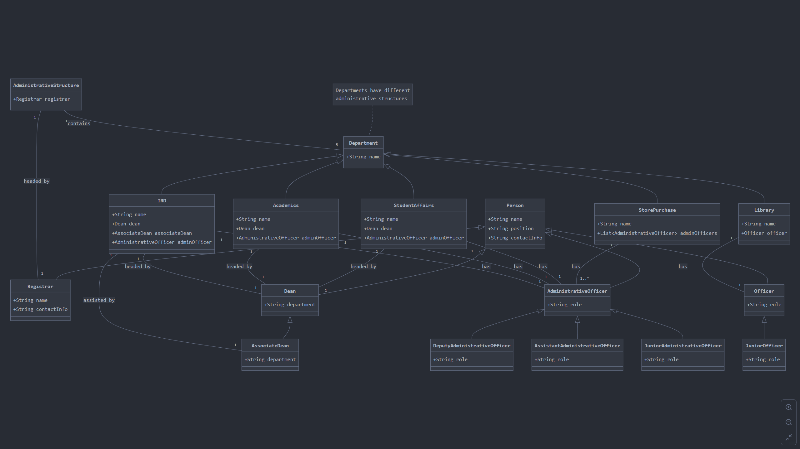

# IIIT-Delhi Administrative Structure - Assignment 2A

## Overview

This C++ program models the administrative and academic structure at IIIT-Delhi, based on the details provided in the assignment. It uses object-oriented programming principles such as classes and inheritance to represent departments, their heads, and officers.

The program reads data related to various personnel in both administrative and academic departments, storing information such as name, position, room number, phone number, and email. The main feature of the program is the ability to search for a person's details (room number, phone number, and email) based on their name.

## Class Diagram

Below is the class diagram for IIIT-Delhi Administrative Structure:



Below is the class diagram for IIIT-Delhi Academic Structure:


## Files

- `Q1.cpp`: The main C++ program that implements the administrative and academic structure.
- `Makefile`: The makefile used to compile the program in different modes (debug and optimized).
- `data.csv`: The CSV file that contains the input data with details of personnel (name, position, address, phone number, email, and department).

## Requirements

To compile and run this program, you need the following:
- C++ compiler (e.g., g++, clang++)
- CSV data file (provided as `data.csv`)
- Makefile (provided)

Make sure that the data file is correctly formatted and follows the expected column structure.

## Compilation Instructions

To compile and execute the program, follow these steps:

1. Navigate to the directory containing the `.cpp` file and `Makefile`:
   
   ```sh
   $ cd MT24119
   ```
2. Run the make command to build the program:
    ```sh
    $ make
    ```
This will create six executables:

- Q1_debug: The debug version.
- Q1_optimised: The optimized version.
- Q1.o: The object file.
- Q2_debug: The debug version.
- Q2_optimised: The optimized version.
- Q2.o: The object file.
  
To execute the optimized code, run:
   ```sh
   $ ./Q1_optimised
   ```
or
   ```sh
   $ ./Q2_optimised
   ```

## Running the Program

Once the program is running, it will prompt you to enter the name of the person to search for. Based on the input, it will output the person's position, phone number, email, and address if they are found in the department.

### Input Format

Once the program is running, it will prompt you to enter the name of the person to search for. Based on the input, it will output the person's position, phone number, email, and address if they are found in the department.

   ```
   $ Enter the name to search for: Prachi Mukherjee
   ```

### Output Format

   ```
   * Assistant Administrative Officer (Academics): Prachi Mukherjee
   * Phone: 011 26907 545
   * Email: prachi@iiitd.ac.in
   * Address: B-207 (Academic Block)
   ```

If the person is not found, it will display:

   ```
   $ No details found for: Prachi Mukherjee
   ```

## Data Format

The program expects the input data file (data.csv) to have the following structure:

```
Level,Position,Name,Phone Number,Fax Number,Emails,Secondary Email,Address
Director,Director (IIIT-Delhi),Prof. Ranjan Bose,91-11-26907481,,bose@iiitd.ac.in,director@iiitd.ac.in,A-707- R & D Block
Dean,Associate Dean of Innovation- Research & Development (ADIRD),Debarka Sengupta,91-11-26907446,,adird@iiitd.ac.in,,
Administrative Officers,Registrar,Dr. Deepika Bhaskar,91-11-26907419,91-11-26907410,deepika@iiitd.ac.in,registrar@iiitd.ac.in,B-204 (Academic Block)
Officers,Junior Administrative Officer (Academics),Aakash Gupta,011 26907 135,,aakash@iiitd.ac.in,,B-207 (Academic Block)
Officers,Assistant Technical Officer (Research) (SG),Abhijeet Mishra,011 26907 555,,abhijeet@iiitd.ac.in,,003 (R & D Block)
Officers,Technical Officer (IT) (SG),Abhinay Saxena,011 26907 574,,abhinay@iiitd.ac.in,,B-105 (Academic Block)

```

The program expects the input data file (data.csv) to have the following structure:

```
Name,Position,Address,Phone,Email,Department
Priti Patwal,Assistant Administrative Officer,A-501 (R&D Block),011 26907 411,pritip@iiitd.ac.in,Computer Science
Sambuddho Chakravarty,Head Of Department,B-503(R&D Block),+91-11-26907355,sambuddho@iiitd.ac.in,Computer Science
Rajiv Ratan Shah,Associate Professor,A-409(R&D Block),+91-11-26907495,rajivratn@iiitd.ac.in,Computer Science
Saket Anand,Associate Professor,B-410(R&D Block),+91-11-26907425,anands@iiitd.ac.in,Computer Science
Debjyoti Bera,Associate Professor,B-508(R&D Block),+91-11-26907442,dbera@iiitd.ac.in,Computer Science
Rinku Shah,Assistant Professor,B-502(R&D Block),+91-11-26907538,rinku@iiitd.ac.in,Computer Science


```

Ensure that the columns are comma-separated and that the data follows this structure.


### Known Issues
- The program assumes the CSV file has no missing data.
- It does not support multiple entries with the same name. If there are multiple people with the same name, only the first match will be returned.

### Future Improvements

- Add input validation to check the integrity of the CSV data.
- Improve error handling for file operations and data parsing.

## References

* The data for this program is taken from the official IIIT-Delhi website: [IIIT-Delhi Administrative People](https://www.iiitd.ac.in/people/administration).
* The data for this program is taken from the official IIIT-Delhi website: [IIIT-Delhi Academic People](https://cse.iiitd.ac.in/people/faculty/).
* Web scraping guidance was provided by this tutorial: [Scraping a Web Page - Part 1](https://www.thedataschool.co.uk/conrad-wilson/scraping-a-web-page-part-1-inspecting-the-html/).
* Understanding class and inheritance in C++ was guided by this tutorial: [Types of Inheritance in C++](https://www.simplilearn.com/tutorials/cpp-tutorial/types-of-inheritance-in-cpp).


